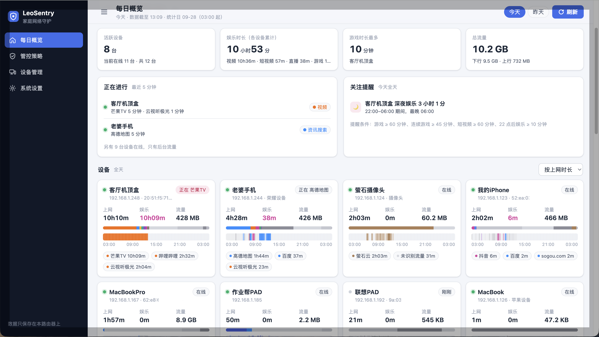
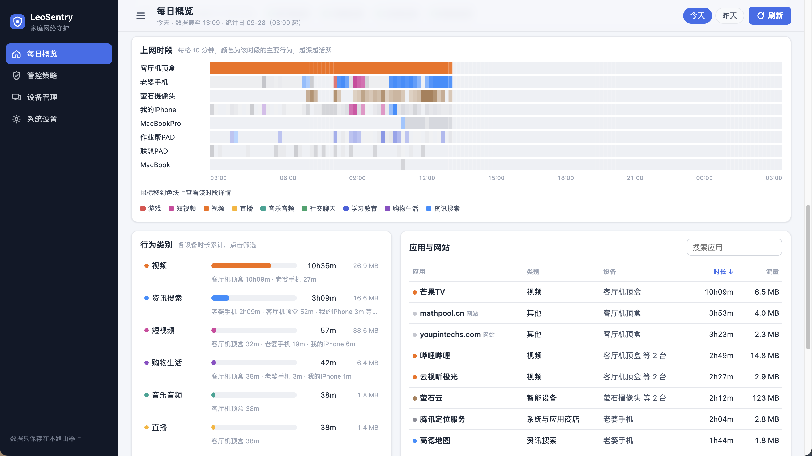
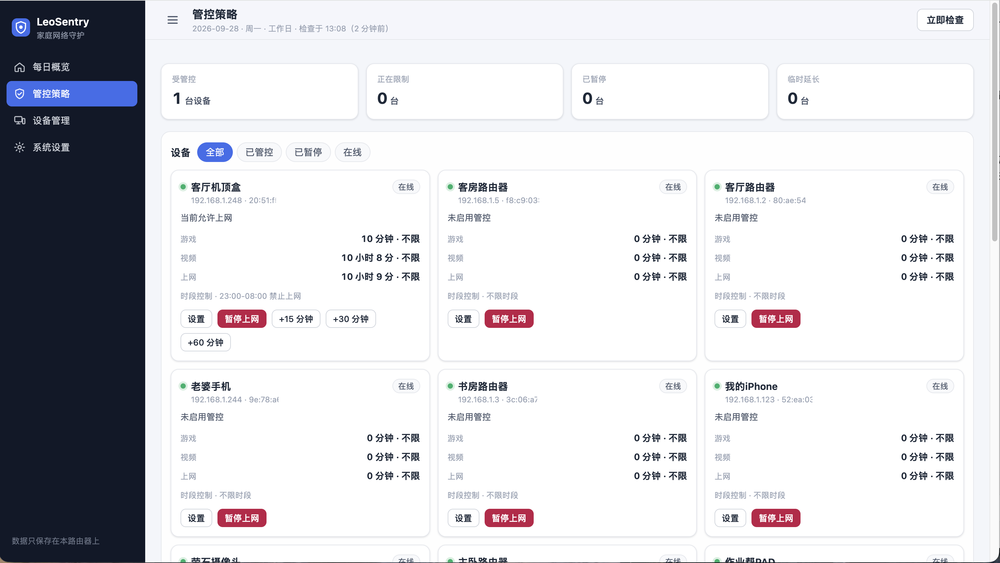
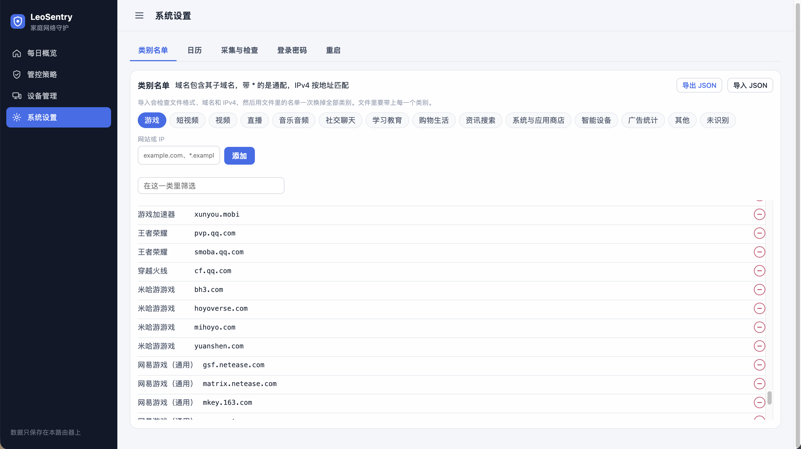
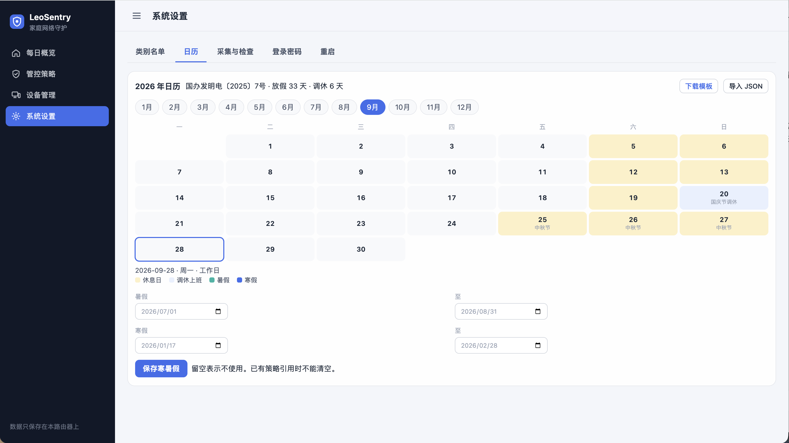

# LeoSentry

运行在软路由上的家庭上网行为监测与管控服务。它观察各设备在访问哪些网站和应用、用了多久，并可以按策略限制上网时段、游戏和视频时长，或立刻暂停某台设备的外网。

程序不转发数据包。转发和丢弃仍由 Linux 内核与 nftables 完成。LeoSentry 只做三件事：**观察、判断、改规则**。

## 界面

每日概览：谁在线、在用什么、用了多久。





管控策略：按设备限制游戏、视频和上网时长，也可以暂停或临时延长。



系统设置：类别名单和法定日历、寒暑假。






| 文档                                     | 内容                    |
| -------------------------------------- | --------------------- |
| [docs/采集层技术设计.md](docs/采集层技术设计.md)     | 流量怎么记下来、设备怎么认出、数据放在哪里 |
| [docs/Web展示技术设计.md](docs/Web展示技术设计.md) | 管理页、登录、分类、策略如何下发到防火墙  |


## 能做什么

- 按「设备 IP × 目标 IP」统计上下行流量，默认每 60 秒一条记录，并滤掉每分钟不足 8 KB 的心跳。
- 用 DHCP 租约、静态绑定和邻居表把 IP 换成 MAC，并记住用户起的设备名。
- 跟踪 dnsmasq 查询日志，把目标 IP 还原成用户最初查询的域名。
- 用内置规则把域名和地址归到游戏、短视频、视频、直播等类别。规则可在页面上增删，也可整份导入导出。
- 每日概览展示今天或昨天：谁在线、在用什么、用了多久、流量多大。筛选和图表在浏览器里完成。
- 按设备设置每日时长和时段。日期可以是每天、法定工作日、法定休息日、指定星期、暑假或寒假。
- 策略默认每 5 分钟检查一次。需要限制时只更新 nft 集合里的地址，不重建整张表。在页面上保存、暂停或临时延长会马上再检查一次。临时延长最多 180 分钟。
- Web 需要登录。首次启动的密码是 `123456`，装好后应立刻改掉。


## 边界

- 流量明细只统计 IPv4。完全禁止上网时还会按 MAC 丢弃转发流量，因此这条路径上的 IPv6 也会断；只禁游戏或视频时，只丢弃当前 DNS 记录里能归到这些类别的 IPv4。
- 加密 DNS（DoH/DoT）、写死的 DNS、以及 App 自己的 HttpDNS，dnsmasq 看不到，对应流量会标成「未识别」，局部拦截也拦不到这些地址。
- 手机系统的随机 MAC 会让同一台设备看起来像新设备。
- 局域网桥接流量不经过 `forward` 钩子，设备之间互访不受这里的规则影响。
- 闪存上只留当前统计日和紧挨着的前一天。更早的明细会删掉。页面没有更长的历史报表。
- 默认会关闭 fw4 流量卸载，否则已建立的连接不再经过计数规则。


## 运行环境

在 ImmortalWrt 25.12（NanoPi R2S / RK3328）上开发和验证。依赖是 OpenWrt 系常见组件，不是绑定某一块板子：


| 项目  | 要求                                                           |
| --- | ------------------------------------------------------------ |
| 系统  | 带 nftables / firewall4、dnsmasq、procd 的 OpenWrt 或 ImmortalWrt |
| 权限  | 以 root 运行（netlink、改 UCI、安装服务）                                |
| 语言  | Go，`CGO_ENABLED=0` 静态编译。模块要求见 `go.mod`                       |
| 存储  | SQLite，纯 Go 驱动 `modernc.org/sqlite`                          |
| 界面  | 静态 HTML / CSS / JS，编译进二进制                                    |


## 架构

```
浏览器 ──HTTP──▶ 静态页面 + REST
                    │
                    ▼
采集 ──▶ 分类与当日聚合 ──▶ 策略引擎 ──▶ nft 集合差量更新 ──▶ inet leosentry
 │
 ├─ dnsmasq 日志 → IP 到域名
 ├─ nft 计数器差分 → 流量明细
 └─ conntrack 差分 → 是否在线
```

启动顺序：时区 → 读出页面里保存的间隔 → 打开数据库 → 系统设置（查询日志、关闭流量卸载）→ 重建 nft 表 → 设备识别 / DNS / conntrack → 做一次策略检查 → Web → 采集循环。退出时先补采不满一个周期的流量，再删掉 nft 表。

数据放在 `data_dir`（默认 `/etc/leosentry/data`）：


| 文件           | 内容              | 寿命      |
| ------------ | --------------- | ------- |
| `today.db`   | 当前统计日的流量明细      | 日切后变成昨天 |
| `prev.db`    | 上一个统计日          | 再日切时删除  |
| `devices.db` | 设备名、首次出现、用过的 IP | 一直保留    |
| `policy.db`  | 策略、日历、类别修改、登录密码 | 一直保留    |


统计日默认从凌晨 03:00 到次日 03:00。0 点到 3 点的使用记在前一天。

## 目录

```
.
├── cmd/leosentry/                 # 入口：运行 / install / uninstall / version
├── internal/
│   ├── app/                       # 组装与启停
│   ├── config/                    # UCI 配置
│   ├── sysconf/                   # dnsmasq、流量卸载、时区、LAN 地址
│   ├── installer/                 # procd 安装与页面触发的重启
│   ├── collector/                 # 采集循环
│   │   ├── dns/                   #   dnsmasq 日志与 DNS Map
│   │   ├── conntrack/             #   在线状态
│   │   └── nftstats/              #   计数器差分
│   ├── device/                    # IP→MAC，以及设备页用的合并目录
│   ├── analyzer/
│   │   ├── activity/              # 今日/昨日概览聚合
│   │   └── category/              # 域名与 IP 分类
│   ├── policy/                    # 时长、时段、日历、下发防火墙
│   ├── nftctl/                    # inet leosentry 的创建与集合差量
│   ├── settings/                  # 页面上改间隔和类别名单
│   ├── store/                     # today.db、prev.db、devices.db、policy.db
│   ├── usage/                     # 内存中的当日累计（随批次更新）
│   ├── statday/                   # 统计日边界
│   ├── uci/                       # UCI 解析
│   ├── fswatch/                   # inotify
│   ├── model/                     # 采集记录与设备模型
│   └── api/                       # HTTP、登录、各页面接口
├── web/static/                    # 管理页
├── assets/rules/                  # 内置分类
├── assets/calendar/               # 内置法定节假日
├── scripts/devweb/                # 本机用示例数据预览页面
├── docs/
├── deploy/openwrt/                # 软件包打包预留，尚未实现
└── Makefile
```

`app` 负责把模块接在一起。`model` 不依赖其他 `internal` 包。采集和 nft 控制不依赖 API。

`internal/analyzer/game` 以及 `internal/policy` 下的 `rule`、`schedule`、`quota` 目前只有包注释，没有接入运行路径。分类在 `internal/analyzer/category`，时长和时段在 `internal/policy`。

## 构建

```sh
make build        # 当前系统
make build-arm64  # linux/arm64，用于 R2S
make test
make vet
```

不连接路由器时，可以用示例数据看页面：

```sh
go run ./scripts/devweb
```

浏览器打开 `http://127.0.0.1:18088/`。这个进程不采集真实流量，也不能代替路由器上的安装。

## 下载

当前版本 **V1.0.1**，适用于 ImmortalWrt / OpenWrt 的 linux/arm64（如 NanoPi R2S）。发布包放在 GitHub Release 上，不进入 git 仓库。

[下载 leosentry-linux-arm64](https://github.com/leovancego/LeoSentry/releases/download/V1.0.1/leosentry-linux-arm64)

[查看 V1.0.1 发布说明](https://github.com/leovancego/LeoSentry/releases/tag/V1.0.1)

## 安装到软路由

在路由器上：

```sh
wget -O /tmp/leosentry https://github.com/leovancego/LeoSentry/releases/download/V1.0.1/leosentry-linux-arm64
chmod +x /tmp/leosentry && /tmp/leosentry install
```

也可以先在电脑上下载，再拷过去。`192.168.1.1` 是文档里的示例地址，改成自己的 LAN 地址。

```sh
scp leosentry-linux-arm64 root@192.168.1.1:/tmp/leosentry
ssh root@192.168.1.1 'chmod +x /tmp/leosentry && /tmp/leosentry install'
```

`install` 会：

1. 把二进制复制到 `/usr/bin/leosentry`；
2. 写入 `/etc/init.d/leosentry`（`START=99`，崩溃自动重启）；
3. 若还没有 `/etc/config/leosentry`，写入带注释的默认配置；已有文件会保留；
4. 设置开机自启并启动。

`leosentry uninstall` 停掉并删掉服务，配置和 `data_dir` 留下。

启动时会自动打开 dnsmasq 查询日志。若 `/etc/dnsmasq.conf` 里已有 `log-facility`，会先把那一行注释掉，否则 dnsmasq 会因重复关键字起不来。重启后做健康检查，失败则回滚。默认还会关闭 fw4 的软件/硬件流量卸载。日志：`logread -e leosentry`。

局域网打开 `http://<LAN IP>:8088/`。HTTPS 默认关闭，配了证书后监听 `8443`，例如 `https://<域名>:8443/`。在「系统设置 → 端口与证书」里可以改 HTTP、HTTPS 端口和证书路径。端口必须是 0 到 65535 的整数，两个不能相同，也不能同时为 0。和当前加载的不一致时，确认框会说明要重启，确认后自动重启。启动时会检查证书；文件打不开、不匹配、过期或端口被占用时，只保留还能监听的那一路。HTTP 和 HTTPS 都绑在全部网卡上，地址是 `:8088` 和 `:8443`。证书要覆盖访问时用的域名。

**第一次登录密码是** `123456`**。** 请在「系统设置 → 登录密码」里修改。会话保存在进程内存中，重启服务后需要重新登录，有效期 30 天。

## 配置

`/etc/config/leosentry` 全部可选。下面是默认值；页面上改过的采集间隔、策略检查间隔和统计日切换会写进 `policy.db`，并覆盖这里的同名项。前两项保存后立刻生效，统计日切换在下次启动后生效。


| 选项                           | 默认         | 说明                                         |
| ---------------------------- | ---------- | ------------------------------------------ |
| `collect_interval`           | `60`       | 采集周期（秒），也是一条记录的时间粒度                        |
| `policy_interval`            | `300`      | 自动检查策略的间隔（秒）                               |
| `conntrack_interval`         | `10`       | 刷新在线状态的间隔（秒）                               |
| `rotate_at`                  | `03:00`    | 统计日分界                                      |
| `min_flow_kb_per_min`        | `8`        | 低于该速率的「设备 → 目标」不记录；`0` 表示全记                |
| `min_free_mb`                | `20`       | 数据分区剩余空间低于该值时暂停写明细                         |
| `managed_network`            | 空          | 受管网段，可写多条；空则用 `lan_device` 上的 IPv4         |
| `lan_device`                 | `br-lan`   | LAN 接口                                     |
| `dns_ttl`                    | `1800`     | 域名映射过期时间（秒）                                |
| `http_port` / `http_address` | `8088` / 空 | HTTP 端口，也可在系统设置里改。服务监听全部网卡（`:端口`），不按这个地址绑定 |
| `https_port`                 | `8443`     | 配了证书之后的 HTTPS 端口，`0` 关闭。443 通常已被占用         |
| `tls_cert` / `tls_key`       | 空          | 证书和私钥绝对路径。留空不启用 HTTPS，也可在系统设置里填写           |
| `archive_dir`                | 空          | 见下方说明                                      |
| `manage_dnsmasq`             | `1`        | 是否自动打开查询日志                                 |
| `disable_flow_offload`       | `1`        | 是否自动关闭流量卸载                                 |


其余路径、日志大小和时区见采集层文档第 7 节。

`archive_dir` 仍会被读取：启动时若留空，日志里会提示未配置归档。当前日切只在闪存上轮换 `today.db` 与 `prev.db`，不再把结束的一天送去归档，管理页也不读归档文件。

